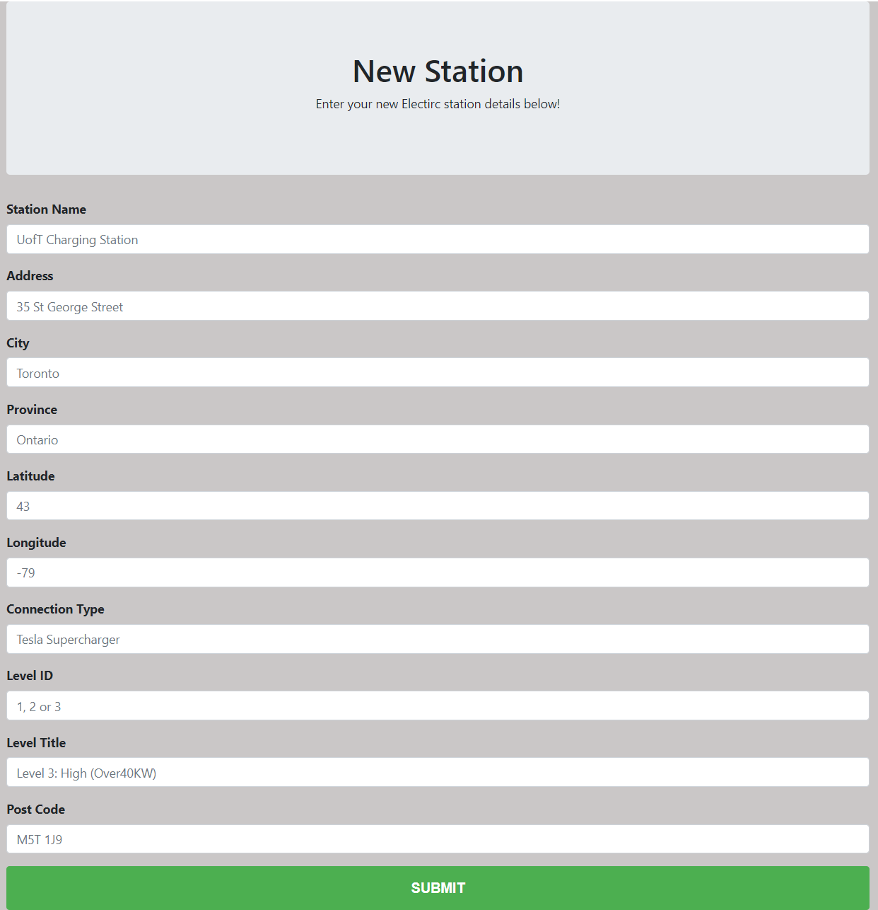

# Electric_Charging_Stations_App

## Background

With the fast development of the global economy, the environmental issue becomes one of the biggest concerns to human beings in terms of the golbal greenhouse effect. In order to help reduce greenhouse gas emissions, one of the greatest inventions is the electric cars(EVs), also known as battery electric cars.

As more and more EVs are drving on the road, the stations for charing EVs also emerge rapidly. EVs have a lot of environmental benefits, for example, they have lower operating and maintenance costs, they produce little or no local air pollution, they reduce dependence on petroleum and also they have the potential to reduce greenhouse gas emissions.

## About the APP

Click [here](https://chargetastic.herokuapp.com/) to view the APP
This is a Flask APP deployed on Heroku with MongoDB. the web APP is aimed at mapping all the electric charging stations across the Canada for new EVs' users. With this APP, users can:

    1. see the distribution of different charging connector types as well as the charging levels
    2. add location information of a new station which is not in the map(database)
    3. see all the locations in Canada
    4. search nearby all the locations with a specific connector type filtered by user
    5. get direction to the selected location with google map routing
    6. see what can you do near a specific location(when the car is charging), such as hotels, restaurants and etc.

## Connector types and charging levels distribution

The data was acquired from the Open Charge Map API, which can be found here: https://openchargemap.org/site. Then a MongoDB database was created on Heroku MLab using the data with about 5000 stations. From the charts above, we can see there are about 10 different types of connectors and 3 different charging levels in total. Type 1(J1772) dominates the connector types while level 2 occupies almost 80% of all the levels.

## Add a location of new station

Just by filling in simple infomation, a user can easily add a new location which was not there in the APP, it can be some official stations run by Tesla for example, or it can jsut be some personal charing points and user and add them to share with neighbors and earn some income.

## See and search the map

With our APP, users can also see the total map and search the stations near them. the screenshot below shows the total stations across Canada, there are about 5000 stations in total.

A user can also search the nearby stations with the connector types they choose. Below is an example map searched nearby  with all the connector types.

From the screenshot, you can see that there are some options for each location, people can see the navigation routing with the help of Google Map, and they can also see what's near the specific location so they can make better plans for their trip.

For getting the directions, below is an example:

For an example of hotels nearby:

